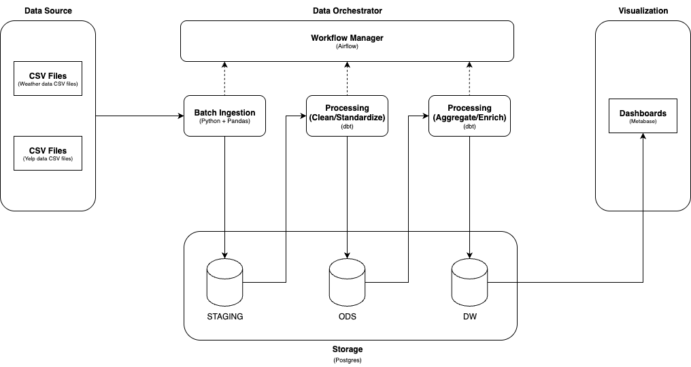

# Weather x Yelp Review Study Case
## Overview
Study case project that merge two massive, real-world datasets in order to draw conclusions about how weather affects Yelp reviews. Using [Yelp open dataset](https://business.yelp.com/data/resources/open-dataset/) and custom Weather data as our dataset.

## Data Architecture
This project implements a simple yet robust data pipeline designed for small to medium-scale data processing, emphasizing simplicity.

## Tech Stack
### Orchestration
- Apache Airflow: Workflow management and scheduling
- Handles dependencies, monitoring, and retry logic
- Provides a clean UI for pipeline monitoring
### Data Processing
- Python + Pandas: Data ingestion and initial processing
- dbt: SQL-based transformations for data cleaning and aggregation
- Lightweight approach suitable for datasets that don't require distributed processing
### Storage
- Postgres: Simple yet powerful database. Suitable for local data warehouse.
  - STAGING: Raw data landing zone
  - ODS: Cleaned and standardized data
  - DW: Analytics-ready aggregated data
### Visualization
- Dashboards: Connected to ClickHouse for real-time analytics
- Self-service reporting and data exploration